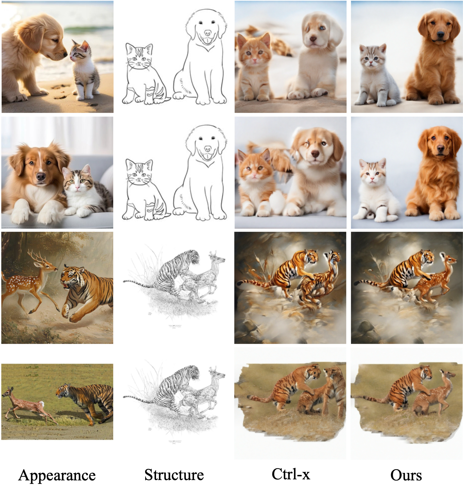

# SegTrans: Enabling Multi-Object Appearance Transfer

This repo builds upon [Ctrl-x](https://github.com/genforce/ctrl-x), a method for training-free and guidance-free appearance and structure control based on diffusion models. We observed that when multiple objects that contain similar parts appear at the same time in the appearance image and structure image, the appearance are mixed together in the output image. To accurately transfer the appearance of each object in this scenario, we propose SegTrans which utilizes SAM2 to find the correspondence between areas of images thereby seperating objects. 

## Single appearance image with multiple objects


## Multiple appearance images
Inspired by the idea of using segmentation to assist appearance transfer, we extend our method to enable multiple appearance images where each one of them provide the appearance of a certain object (or objects). This way, it is much easier to create interesting image using this method since one can put different objects that never appear to be together in a same image, interacting with each other, using just a sketch or some sort of structure image as control. 


## Getting started

### Environment setup

Our code is built on top of [`Ctrl-x`]([https://github.com/huggingface/diffusers](https://github.com/genforce/ctrl-x)) and [`SAM2`](https://github.com/facebookresearch/sam2). 

To set up the environment, first clone this repo, then install SAM2 in `SegTrans/`.
## Installing SAM2

SAM 2 needs to be installed first before use. The code requires `python>=3.10`, as well as `torch>=2.5.1` and `torchvision>=0.20.1`. Please follow the instructions [here](https://pytorch.org/get-started/locally/) to install both PyTorch and TorchVision dependencies. You can install SAM 2 on a GPU machine using:

```bash
git clone https://github.com/facebookresearch/sam2.git && cd sam2

pip install -e .
```
Download checkpoints by running:

```bash
cd checkpoints && \
./download_ckpts.sh && \
cd ..
```
For installation problems, please visit [`SAM2`](https://github.com/facebookresearch/sam2) for more details.

## Set up environment for ctrl-x

To set up the environment, please run the following.
```
pip install diffusers==0.28.0
```

### Running SegTrans

Use run.sh to run the case with just one appearance image
```
bash scripts/run.sh
```
Use run_multiple.sh for multiple appearance images
```
bash scripts/run_multiple.sh
```

